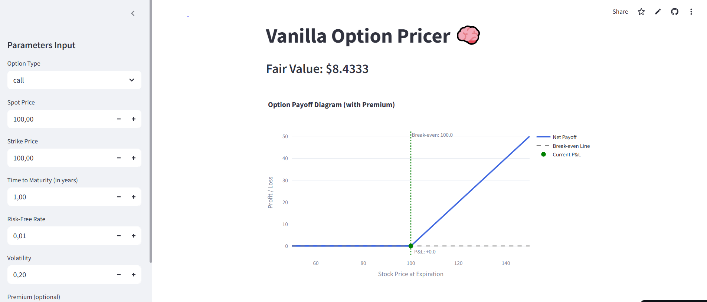

# 📈 Option Pricer Demo App

An interactive web application for pricing European options using the Black-Scholes model. The app computes the option price, visualizes key behaviors and sensitivities, and provides insight into the option’s risk profile through the Greeks and volatility smile.

---

## 🔧 Features

- ✅ Black-Scholes pricing for European **call** and **put** options  
- 📊 Visual breakdown of:
  - **Option Price (calculated value)**
  - **Payoff Diagram**
  - **Sensitivity to:**
    - Stock Price
    - Time to Maturity
    - Volatility
    - Interest Rate
  - **Greeks Table** (Delta, Gamma, Vega, Theta, Rho)
  - **Volatility Smile**
- ⚡ Interactive UI with real-time updates  
- 🎯 Built for clarity, exploration, and educational use

---

## 🛠️ Tech Stack

- `Python`  
- `Streamlit`  
- `Plotly`  
- `NumPy`, `SciPy`

---

## 📂 Project Structure

``` 
Option-Pricer-Demo-App/
├── app.py # Main Streamlit app
├── utils/
│ └── greeks.py # Greeks calculations
│ └── pricing_models.py # Black-Scholes pricing logic
│ └── visuals.py # Charting and visual components
├── requirements.txt # Python dependencies
└── README.md # Project documentation
```

---


## ⚙️ Getting Started

To run the app locally:

```bash
git clone https://github.com/kejjorfi97/Option-Pricer-Demo-App.git
cd Option-Pricer-Demo-App
pip install -r requirements.txt
streamlit run app/main.py
```

## 🚀 Live Demo

👉 [Launch the App](https://option-pricer-demo-app.streamlit.app/)

---

## 📸 Screenshot


---

## 📌 Use Cases

- Educational tool for financial derivatives  
- Interactive exploration of the Black-Scholes model  
- Interview prep for quantitative finance roles  
- Portfolio piece for data science or finance-focused roles

---

## 👤 Author

Developed by **Khalil EJ-JORFI**  
🔗 [LinkedIn](https://www.linkedin.com/in/khalil-ej-jorfi-262291146/)  
💻 [GitHub](https://github.com/kejjorfi97)

---

## 📜 License

This project is licensed under the MIT License. See the [LICENSE](LICENSE) file for details.

